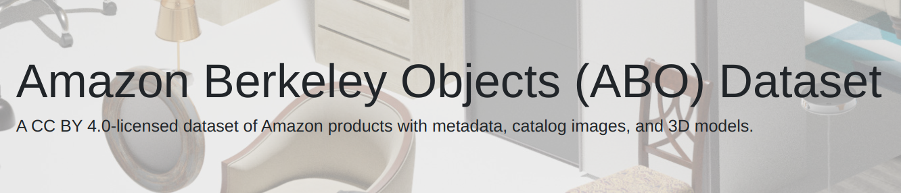

# Visual Question Answering (VQA)

## System Requirements

- Python 3.9 or higher  
- 2 × 16 GB GPUs (either local or cloud-based)

---

## Environment Setup

1. After cloning the repo ```cd ``` into it and create a virtual environment:
   ```bash
   python3 -m venv env
   source env/bin/activate
   ```

2. Install required dependencies:
   ```bash
   pip install -r requirements.txt
   ```

---

## Dataset Curation

Download the ABO dataset from the following link:




[ABO Images Small (Amazon Berkeley Objects)](https://amazon-berkeley-objects.s3.amazonaws.com/archives/abo-images-small.tar)

After downloading, extract and organize the files such that the `dataset/` directory has the following structure:

```
dataset/
├── abo-listings/
│   └── listings/
│       └── metadata/
└── images/
    ├── metadata/
    └── small/
        ├── 00/
        ├── 01/
        ├── 02/
        ├── ...
        └── ff/
```

---

### Running the Scripts

All processing and training scripts are located in the `scripts/` directory. You may either run them one at a time for manual interpretation or sequentially in batch mode. Ensure that file paths (absolute or relative) are correctly set according to your working directory.

### Recommended Execution Order:
1. `eda.ipynb` – Exploratory Data Analysis  
2. `filter.ipynb` – Filtering relevant attributes  
3. `curate.ipynb` – Dataset curation for model training

---

## Model Training & Evaluation

- Remaining scripts in the `scripts/` directory can be used to fine-tune and evaluate models according to specific configurations.
- Note: Model fine-tuning was performed on **Kaggle’s free-tier GPUs**. When running the scripts locally, ensure all dataset paths are updated appropriately.

---

## Outputs

The results from fine-tuning and evaluation are stored in the `outputs/` directory as `.csv` files. File naming follows a structured format for clarity:

Example:
- `blip_vqa_finetuned_r16_e7_metrics.csv`:  
  Contains accuracy metrics evaluated every 1000 test samples for a model fine-tuned with LoRA rank `r=16` over `7` epochs.
  
- `blip_vqa_finetuned_r16_e7_predictions.csv`:  
  Contains image paths, questions, ground-truth answers, and predicted answers for the same configuration.

---

## Notes

- Ensure appropriate GPU support for training and inference.
- Modify any hardcoded paths in the notebooks or scripts when switching between local and cloud environments.
- **IMT2022019_044_087** is the inference script which contains ```inference.py``` and ```requirements.txt```
---

